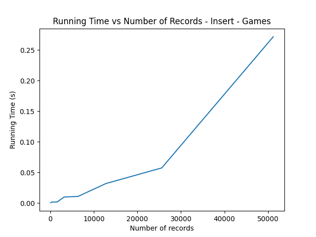
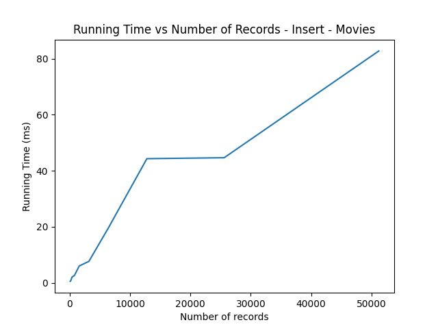
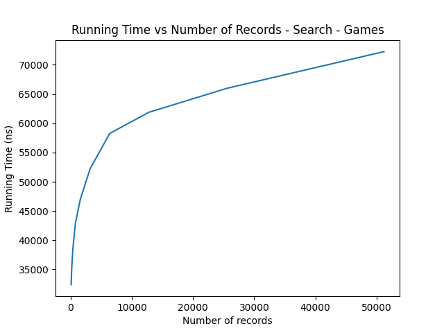
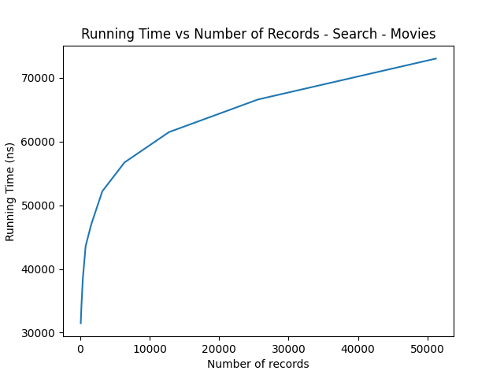
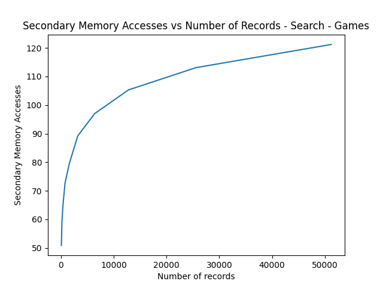
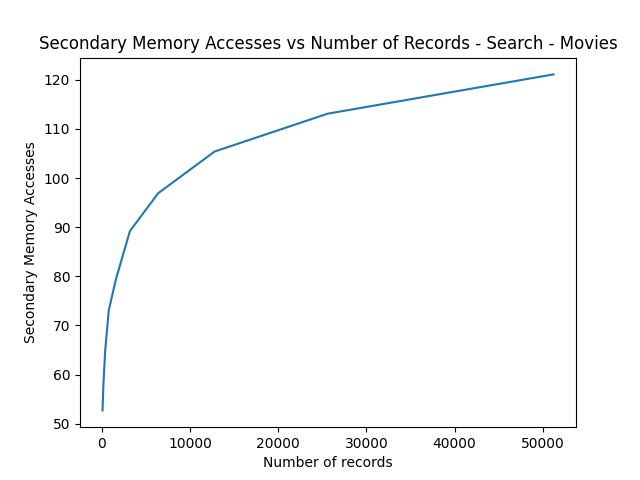

# bd2_project1_extendible_hashing_avl_tree

BD2 Project 1

### **Integrantes**

* Mario Rios Gamboa
* Luis Berrospi Rodriguez
* Angello Zuloaga Loo

## **Tabla de contenido**

- [bd2\_project1\_extendible\_hashing\_avl\_tree](#bd2_project1_extendible_hashing_avl_tree)
    - [**Integrantes**](#integrantes)
    - [**Tabla de contenido**](#tabla-de-contenido)
- [**Introducción**](#introducción)
    - [**Objetivo**](#objetivo)
    - [**Dominio de Datos**](#dominio-de-datos)
        - [**Dataset games**](#dataset-games)
        - [**Dataset movies**](#dataset-games)
- [**Técnicas Utilizadas**](#técnicas-utilizadas)
    - [**AVL File**](#avl-file)
        - [**Clase AVL**](#clase-avl)
            - [Uso](#uso)
        - [**Función Insert**](#función-insert)
            - [Uso](#uso-1)
        - [**Función Delete**](#función-delete)
            - [Uso](#uso-2)
        - [**Función Search**](#función-search)
            - [Uso](#uso-3)
        - [**Función Search Range**](#función-search-range)
            - [Uso](#uso-4)
    - [**Extendible Hash**](#extendible-hash)
        - [**Clase ExtendibleHash**](#clase-extendiblehash)
            - [Uso](#uso-5)
        - [**Función Insert**](#función-insert-1)
            - [Uso](#uso-6)
        - [**Función Delete**](#función-delete-1)
            - [Uso](#uso-7)
        - [**Función Search**](#función-search-1)
            - [Uso](#uso-8)
        - [**Función Search Range**](#función-search-range-1)
            - [Uso](#uso-9)
- [**Resultados**](#resultados)
    - [**AVL Tree**](#avl-tree)
        - [**Insert**](#insert)
        - [**Insert Memory Access**](#insert-memory-access)
        - [**Search**](#search)
        - [**Search Memory Access**](#search-memory-access)
    - [**Extendible Hash**](#extendible-hash-1)
        - [**Insert**](#insert-1)
        - [**Insert Memory Access**](#insert-memory-access-1)
        - [**Search**](#search-1)
        - [**Search Memory Access**](#search-memory-access-1)

# **Introducción**

## **Objetivo**

El objetivo del presente proyecto es desarrollar un Sistema Gestor de Base de Datos (SGBD) con sus
principales funciones para el manejo de datos (insert, search, delete), utilizando técnicas
estudiadas en clase y que sean implementadas de tal forma de que el sistema sea eficiente y amigable
para el usuario.

## **Dominio de Datos**

En cuanto a los datos, se trabaja con los siguientes archivos en formato csv delimitados por el
caracter '|'

### **Dataset games**

Presenta los siguientes campos:

| **Campo** | **Tipo** |
| --- | --- |
| publisher | `char[90]` |
| gameTitle | `char[150]` |
| price | `float` |

### **Dataset movies**

Presenta los siguientes campos:

| **Campo** | **Tipo** |
| --- | --- |
| id | `int` |
| primaryTitle | `char[419]` |
| startYear | `char[5]` |
| genres | `char[32]` |

Ambos datasets se pueden encontrar en [link a carpeta](https://drive.google.com/drive/folders/1wCLJ-d_lk_wgmaPoDGnArh_kb5j0jd9F?usp=sharing)

# **Técnicas Utilizadas**

## **AVL File**

Se implemento un AVL con las fucniones de insert, delete, search y search por rango para el manejo
de los datos. Se utilizó una clase Template para poder manejar los tipos de datos que se pueden
recibir, además se utilizaron *statments* de tipo `if constexpr` para poder mejorar el performance
del programa al decidir en tiempo de compilación que código se ejecutará dependiendo del template.

### **Clase AVL**

Crea un nuevo objeto AVLTree que representa un árbol AVL implementado en memoria secundaria,
utilizando el archivo especificado.

```c++
template <typename Record>
AvlTree(std::string &file_name);
```

- **Parámetros**
    - `file_name`: El nombre del archivo en el que se almacenarán los datos del árbol.
- **Valor de retorno**
    - Ninguno.
- **Precondiciones**
    - `file_name` debe ser una cadena de caracteres que represente un archivo existente y accesible.
- **Postcondiciones**
    - Se crea un nuevo objeto AVLTree que representa un árbol AVL implementado en memoria
      secundaria.
    - Si el archivo especificado ya existe, los datos previamente almacenados en él se cargarán en
      la estructura del árbol cuando se invoquen.

#### Uso

```c++
AVLTree avl("tree.dat");
```

Crea un nuevo objeto AVLTree que utiliza el archivo tree.dat para almacenar los datos del árbol.

### **Función Insert**

Se encarga de insertar un registro de tipo `Record` en un árbol AVL implementado en memoria
secundaria.

```c++
bool insert(Record &record)
```

- **Parámetros**
    - `record`: Referencia a un registro de tipo `Record` que se desea insertar en el árbol AVL.
- **Valor de retorno**
    - `true`:  si el registro fue insertado correctamente en el árbol AVL.
    - `false`: si el registro no pudo ser insertado en el árbol AVL.
- **Precondiciones**
    - El archivo binario que representa al árbol AVL debe existir en el sistema de archivos.
    - El registro record a insertar debe ser del mismo tipo que los registros almacenados en el
      árbol AVL.
- **Postcondiciones**
    - El registro record es insertado correctamente en el árbol AVL, tomando en cuenta la
      actualización de alturas, rotaciones y dobles rotaciones necesarias para su funcionamiento.
    - Si el árbol AVL estaba vacío, el registro record se convierte en la raíz del árbol.

#### Uso

```c++
GameRecord newGameRecord;
newGameRecord.publisher = "Nintendo";
newGameRecord.gameTitle = "The Legend of Zelda: Breath of the Wild";
newGameRecord.price = 59.99;

avl_tree.insert(newGameRecord);
```

Aquí creamos un nuevo registro de juego `newGameRecord` con el editor `Nintendo`, el título del
juego `The Legend of Zelda: Breath of the Wild` y el precio de venta `59.99`. Luego, llamamos a la
función insert en el árbol AVL instanciado `avl_tree`, pasando `newGameRecord` como el registro a
insertar. La función devuelve `true` si la inserción fue exitosa.

### **Función Delete**

Elimina un elemento del árbol AVL, buscando el elemento con la clave `key`. Utiliza un método de
eliminación lógico.

```c++
template <typename T>
bool delete_item(T key);
```

- **Parámetros**
    - `T key`: clave del elemento a eliminar
- **Valor de retorno**
    - `true`: si el elemento fue eliminado exitosamente
    - `false`: si ocurrió un problema al eliminar el elemento.
- **Precondiciones**
    - El archivo donde se encuentra almacenado el árbol AVL debe existir en el sistema de archivos.
    - La clave `key` debe ser del mismo tipo que las claves de los registros almacenados en el árbol
      AVL.
- **Postcondiciones**
    - Si el elemento con clave key se encontraba en el árbol AVL, este será eliminado del archivo de
      manera lógica.

#### Uso

```c++
// Creamos un árbol AVL de enteros y agregamos algunos elementos
MemoryAVLTree<MovieRecord> tree("tree.dat");
// Eliminamos el elemento con clave 20
if (tree.delete_item(20)) {
    std::cout << "Elemento eliminado exitosamente\n";
} else {
    std::cout << "No se encontró el elemento a eliminar\n";
}
```

En este ejemplo, creamos un árbol AVL de `MovieRecords` utilizando el archivo `tree.dat`. Luego,
llamamos a la función `delete_item` para eliminar el elemento con id 20. Si el elemento se encuentra
en el árbol y es eliminado exitosamente, se imprimirá el mensaje "Elemento eliminado exitosamente".
En caso contrario, se imprimirá "No se encontró el elemento a eliminar".

### **Función Search**

busca un registro en el árbol AVL implementado en memoria secundaria, utilizando el nombre como
clave de búsqueda. Devuelve el registro correspondiente si se encuentra en el árbol, y si no se
encuentra devuelve un registro vacío con altura -1.

```c++
template<typename T>
Record search_by_name(T name);
```

- **Parámetros**
    - `name`: Un valor de tipo genérico `T` que representa el nombre a buscar en el árbol AVL.
- **Valor de retorno**
    - `Record`: Devuelve un registro de tipo Record que representa el registro encontrado en el
      árbol AVL.
- **Precondiciones**
    - El archivo donde se encuentra almacenado el árbol AVL debe existir en el sistema de archivos.
    - La clave `name` debe ser del mismo tipo que las claves de los registros almacenados en el
      árbol AVL.
- **Postcondiciones**
    - Se devuelve el registro correspondiente si se encuentra en el árbol, y si no se encuentra
      devuelve un registro vacío con altura -1.

#### Uso

```c++
AVLTree<GameRecord> tree("game_index.dat");
// Buscamos el registro por su nombre
Record result = tree.search_by_name("Call of Duty: Modern Warfare");

// Imprimimos el registro encontrado
std::cout << "Registro encontrado: " << result.gameTitle << std::endl;
```

En este ejemplo, se crea una instancia de un árbol AVL un archivo "game_index.dat".. Finalmente, se
busca el registro por su nombre utilizando la función `search_by_name` y se imprime en la consola el
nombre del registro encontrado.

### **Función Search Range**

Busca y devuelve un vector de registros de un árbol AVL implementado en memoria secundaria, cuyo
nombre está entre dos valores `name1` y `name2`.

```c++
template<typename T>
std::vector<Record> search_by_name_range(T name1, T name2);
```

- **Parámetros**
    - `name1`: Valor de tipo genérico `T` que representa el nombre inicial del rango de búsqueda.
    - `name2`: Valor de tipo genérico `T` que representa el nombre final del rango de búsqueda.
- **Valor de retorno**
    - `std::vector<Record>`: Un vector de registros que cumplen con la condición de que su nombre
      está entre `name1` y `name2`.
- **Precondiciones**
    - El archivo donde se encuentra almacenado el árbol AVL debe existir en el sistema de archivos.
    - Los registros del árbol deben tener el campo key que se pueda comparar con los valores name1 y
      name2.
- **Postcondiciones**
    - Se devuelve un vector de registros que cumplen con la condición de que su nombre está
      entre `name1` y `name2`.

#### Uso

```c++
AvlTree<GameRecord> avlTree("games.dat");

char left[150] = "A";
char right[150] = "G";
auto result = avlTree.search_by_name_range(left, right);

for (auto &i : result) {
    std::cout << i.publisher << " "  << i.gameTitle <<" " <<i.publisher << std::endl;
}
```

En este ejemplo, se crea una instancia de un árbol AVL un archivo "games.dat". Luego, se busca un
vector de registros cuyo nombre está entre "A" y "G" utilizando la función `search_by_name_range` y
se imprime en la consola el nombre de los registros encontrados.

## **Extendible Hash**

### **Hiperparámetros**
```c++
#define GLOBAL_DEPTH 16
#define BUCKET_SIZE 400
```
- **Parámetros**
    - `GLOBAL_DEPTH`: profundidad global (máxima profundidad de los buckets)
    - `BUCKET_SIZE`: tamaño de los buckets, es decir cantidad de registros que pueden almacenar
    antes de hacer overflow y encadenar

Se utilizó un GLOBAL_DEPTH de 16 pues 1 << 16 = 65536. Este número se aproxima a la cantidad de registros
máxima que se iba a procesar.

### **Clase ExtendibleHash**

Descripcion del algoritmo

```c++
ExtendibleHashingGames(const string &indexFileName, const string &dataFileName);
ExtendibleHashingMovies(const string &indexFileName, const string &dataFileName);
```

- **Parámetros**
    - `indexFileName`: nombre del archivo donde se guarda el índice
    - `dataFileName`: nombre del archivo donde se almacenan los datos
- **Valor de retorno**
    - Ninguno
- **Precondiciones**
    - `indexFileName`: debe existir
    - `dataFileName`: debe existir
- **Postcondiciones**
    - Se crea un Extendible Hashing Tree para el dataset Movies o Games que representa a la estructura en memoria secundaria
    - Si los archivos ya existían, cualquier acceso que se haga harán referencia a los datos guardados
    - Si el archivo de index está vacío, se llena el archivo con los 2 primeros buckets
    que son los buckets con valores 0 y 1 y profundidad local 1. El resto de los buckets se inicializan con profundidad local 0 para indicar que están vacíos y no tienen registros.

#### Uso

```c++
ExtendibleHashingGames extendibleHashingGames("index.dat", "data.dat");
ExtendibleHashingMovies extendibleHashingMovies("index.dat", "data.dat");
```

Crea un Extendible Hashing Tree para el dataset Movies o Games con índice en el archivo "index.dat" y datos en el archivo "data.dat"

### **Función Hash**

Se encarga de calcular el hash de un registro

```c++
// games
static int hash(char gameTitle[TITLE_GAME_SIZE])
{
    int hashValue = 0;
    for (int i = 0; i < TITLE_GAME_SIZE; i++)
    {
        if (gameTitle[i] == '\0')
            break;
        hashValue += gameTitle[i];
    }
    return hashValue % (1 << GLOBAL_DEPTH);
}
```

```c++
// movies
static int hash(int id)
{
    return id % (1 << GLOBAL_DEPTH);
}
```
- **Parámetros**
    - `id`: id del registro
    - `gameTitle`: título del juego
- **Valor de retorno**
    - `int`: hash del registro
    - `int`: hash del registro


### **Función Insert**

Se encarga de insertar un registro en el Extendible Hashing Tree

```c++
// games
bool add(RecordGames record);
```
```c++
// movies
bool add(RecordMovies record);
```

- **Parámetros**
    - `record`: registro a insertar
- **Valor de retorno**
    - `true`: si se pudo insertar el registro
    - `false`: si no se pudo insertar el registro
- **Precondiciones**
    - Los archivos donde se encuentra almacenado el Extendible Hashing Tree debe existir en el sistema de archivos.
- **Postcondiciones**
    - El registro es insertado en el Extendible Hashing Tree, tomando en cuenta la asignación de buckets con la función de hash y la profundidad local de cada uno.
    - Si el bucket donde se quiere insertar el registro está lleno, primero se verifica si se puede hacer split del bucket (si su profundidad local es menor que la global). Si no se puede, se hace overflow y se encadena el registro al bucket siguiente.

#### Uso

```c++
ExtendingHashingGames extendingHashingGames("index.dat", "data.dat");

RecordGames record;
strcpy(record.gameTitle, "game title");
strcpy(record.publisher, "publisher");
record.price = 10.0;

extendingHashingGames.add(record);
```

Aquí se crea una instancia de un Extendible Hashing Tree para el dataset Games con índice en el archivo "index.dat" y datos en el archivo "data.dat". Luego, se crea un registro y se inserta en el Extendible Hashing Tree. La función `add` devuelve `true` si se pudo insertar el registro y `false` si no se pudo.

### **Función Delete**

Elimina un registro del Extendible Hashing Tree, buscando el registro con la clave 'key'. Utiliza
eliminación lógica.

```c++
// games
bool remove(char gameTitle[TITLE_GAME_SIZE]);
```
```c++
// movies
bool remove(int id)
```
- **Parámetros**
    - [games] `gameTitle`: título del juego que es la clave del registro
    - [movies] `id`: id del registro que es la clave del registro
- **Valor de retorno**
    - `bool`: `true` si se pudo eliminar el registro, `false` si no se pudo
- **Precondiciones**
    - Los archivos donde se encuentra almacenado el Extendible Hashing Tree debe existir en el sistema de archivos.
- **Postcondiciones**
    - Si el elemento existe, se elimina del Extendible Hashing Tree y se devuelve `true`. Si no existe, se devuelve `false`.

#### Uso

```c++
ExtendingHashingGames extendingHashingGames("index.dat", "data.dat");

extendingHashingGames.remove("game title");
```

Aquí se crea una instancia de un Extendible Hashing Tree para el dataset Games con índice en el archivo "index.dat" y datos en el archivo "data.dat". Luego, se elimina el registro con clave "game title" del Extendible Hashing Tree. La función `remove` devuelve `true` si se pudo eliminar el registro y `false` si no se pudo.

### **Función Search**

Descripcion del algoritmo

```c++
// games
variant<RecordGames, nullptr_t> search(char gameTitle[TITLE_GAME_SIZE]);
```

```c++
// movies
variant<RecordMovies, nullptr_t> search(int id)
```

- **Parámetros**
    - [games] `gameTitle`: título del juego que es la clave del registro
    - [movies] `id`: id del registro que es la clave del registro
- **Valor de retorno**
    - [games] `variant<RecordGames, nullptr_t>`: registro si se encontró, `nullptr` si no se encontró
    - [movies] `variant<RecordMovies, nullptr_t>`: registro si se encontró, `nullptr` si no se encontró
- **Precondiciones**
    - Los archivos donde se encuentra almacenado el Extendible Hashing Tree debe existir en el sistema de archivos.
- **Postcondiciones**
    - Se devuelve el registro si se encontró, `nullptr` si no se encontró.

#### Uso

```c++
ExtendingHashingGames extendingHashingGames("index.dat", "data.dat");

variant<RecordGames, nullptr_t> record = extendingHashingGames.search("game title");
```

Aquí se crea una instancia de un Extendible Hashing Tree para el dataset Games con índice en el archivo "index.dat" y datos en el archivo "data.dat". Luego, se busca el registro con clave "game title" en el Extendible Hashing Tree. La función `search` devuelve el registro si se encontró, `nullptr` si no se encontró.

### **Función Search Range**

Solo implementado en caso de que el key sea un entero. Busca todos los registros que tengan una clave entre `key1` y `key2`.

```c++
vector<RecordMovies> rangeSearch(int idBegin, int idEnd);
```

- **Parámetros**
    - `idBegin`: clave inicial
    - `idEnd`: clave final
- **Valor de retorno**
    - `vector<RecordMovies>`: vector con los registros encontrados
- **Precondiciones**
    - Los archivos donde se encuentra almacenado el Extendible Hashing Tree debe existir en el sistema de archivos.
- **Postcondiciones**
    - Se devuelve un vector con los registros que tienen una clave entre `key1` y `key2`.

#### Uso

```c++
ExtendingHashingMovies extendingHashingMovies("index.dat", "data.dat");

vector<RecordMovies> records = extendingHashingMovies.rangeSearch(1, 10);
```

Aquí se crea una instancia de un Extendible Hashing Tree para el dataset Movies con índice en el archivo "index.dat" y datos en el archivo "data.dat". Luego, se buscan los registros con clave entre 1 y 10 en el Extendible Hashing Tree. La función `rangeSearch` devuelve un vector con los registros encontrados.

# **Resultados**

Para los resultados se promedió el resultado de multiples pruebas para cada uno de los algoritmos,
se utilizaron archivos con 52000 registros como mínimo. Se decidió tomar pruebas para tiempo de
insert, número de accesos a memoria durante insert, tiempo de busqueda y numeró de accesos a memoria
durante la busqueda cuando se llevaba a los breakpoints: 100, 200, 400, 800, 1600, 3200, 6400,
12800, 25600 y 51200. Cabe mencionar que para cada uno de los dos csv de prueba (peliculas y
videojuegos) se manejaron distintos tipos de keys a indexar (entero y string).

Se utilizó el cluster Khipu de la UTEC para realizar las pruebas. El mismo cuenta con un CPU Intel(
R) Xeon(R) Gold 6230 CPU @ 2.10GHz. Se utilizó una cuenta educativa, por lo cual se contaba con:

- 72 cores del procesador
- 320 GB de memoria RAM
- 1.4 TB de almacenamiento

## **AVL Tree**

### **Insert**

<p float="left">
  
   
</p>
Se puede observar como el tiempo de inserción para el árbol AVL bastante alto, llegando a tomar poco más de 0.25 segundos al momento de insertar cerca de 50000 registros. Por otro lado se puede observar la diferencia entre el tiempo de inserción de un árbol AVL que indexa un campo de tipo entero y uno que indexa un campo de tipo string. Se puede observar que el tiempo de inserción para el árbol que indexa un campo de tipo entero es menor que el tiempo de inserción para el árbol que indexa un campo de tipo string. Esto se debe a que la comparación de enteros es más rápida que la comparación de strings. 

### **Insert Memory Access**

<p float="left">
  
  
</p>
Se puede observar como el número de accesos a memoria para el árbol AVL es bastante alto, llegando a tomar cerca de 3000000 accesos a memoria al momento de insertar cerca de 50000 registros. Por otro lado se puede seguir observando la diferencia entre el número de accesos a memoria de un árbol AVL que indexa un campo de tipo entero y uno que indexa un campo de tipo string. La execiva cantidad de accesos a memoria se debe a que el árbol AVL es requiere de un gran número de comparaciones para poder insertar un nuevo registro, además de que el árbol AVL es un árbol balanceado, por lo que se requiere de un gran número de rotaciones para mantener el árbol balanceado.

### **Search**

<p float="left">
  
  
</p>
Se puede observar como el tiempo de búsqueda para el árbol AVL cuenta con comportamiento logarítmico, estó tambien se ve reflejado en que ya no hay mucha diferencia entre realizar la busqueda entre tipos enteros y strings. Esto se debe a que el árbol AVL es un árbol balanceado (para 52000 registros solo necesitaria 16 comparaciones), la cantidad de comparaciones es bastante menor que el insert, por lo que deja de ser un factor determinante en el tiempo de búsqueda. 

### **Search Memory Access**

<p float="left">
  
  
</p>
Se puede ver como el número de accesos a memoria para el árbol AVL se sigue comportando de manera logarítmica, al igual que el insert. De la misma manera, no hay mucha diferencia entre los tipos de la llave de busqueda.

## **Extendible Hash**

### **Insert**

<p float="left">
  
  
</p>
Se puede observar como el tiempo de inserción para el hash extensible es bastante bajo y constante, llegando a tomar poco más de 50 microsegundos (games) al momento de insertar cerca de 50000 registros. Por otro lado se puede observar la diferencia entre el tiempo de inserción para ambos datasets. Esto se debe a que en el caso de Movies, el struct cuenta con mas campos (y bytes), por lo que el tamaño del registro es mayor, lo que hace que el tiempo de inserción sea mayor.

### **Insert Memory Access**

<p float="left">
  
  
</p>
Se puede observar como el número de accesos a memoria para el hash extensible es bastante bajo y constante, llegando a tomar cerca de 30 accesos a memoria (games) al momento de insertar cerca de 50000 registros. Por otro lado ya no se observa diferencia entre el número de accesos a memoria para ambos datasets. Esto se debe a que las operaciones son las mismas, independientemente del tamaño del registro.

### **Search**

<p float="left">
  
  
</p>
Se puede observar como el tiempo de búsqueda para el hash extensible es bastante bajo y cuenta con comportamiento constante tomando alrededor de 35 microsegundos (games). Nuevamente, existe diferencia entre realizar la busqueda entre tipos enteros y strings. En este caso, este se debe a que la comparación de enteros es más rápida que la comparación de strings. En c++ se utiliza la función `strcmp` para comparar strings, la cual es lenta. Mientras que para comparar enteros se utiliza el operador `==`.

### **Search Memory Access**

<p float="left">
  
  
</p>

Se puede ver como el número de accesos a memoria para el hash extensible es bastante bajo y se sigue comportando de manera constante tomando alrededor de 22 accesos a memoria (games). Al igual que en el caso del insert, no hay mucha diferencia entre los tipos de la llave de busqueda. Esto se debe a que las operaciones son las mismas, independientemente del tamaño del registro.
